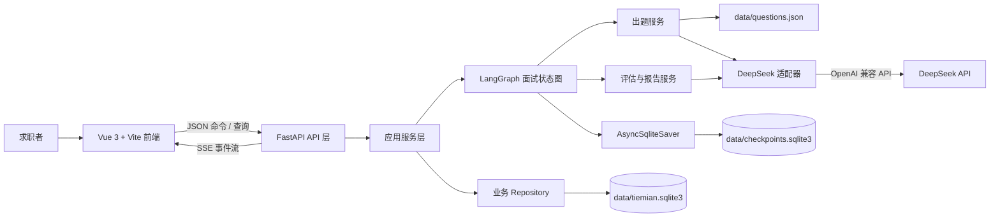
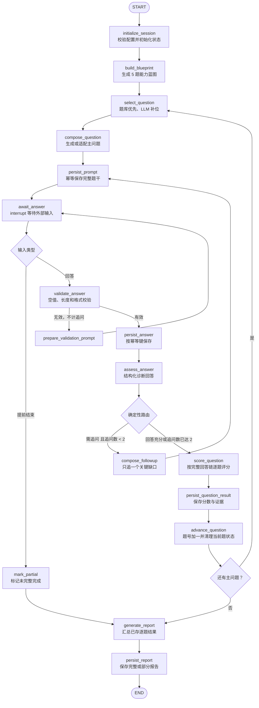

# 铁面：技术架构设计

> 文档状态：架构基线草案  
> 需求依据：[01-需求文档.md](./01-需求文档.md)  
> 技术栈：Python 3.12、FastAPI、LangChain、LangGraph、SQLite、DeepSeek API、Vue 3、Vite  
> 本文边界：只定义架构、契约和目录规划，不包含业务实现代码。  
> 官方资料核对日期：2026-07-21

## 1. 目标、约束与结论

### 1.1 架构目标

本架构首先保证以下能力，而不是追求通用 Agent 平台：

1. 一场固定 5 道主问题、每题最多追问 2 次的面试可以确定地结束。
2. 每次提问、回答、追问和评分均可恢复、可追溯、可幂等重试。
3. LLM 负责生成和判断，业务规则负责流程边界；LLM 不能绕过追问上限、题数上限和报告完整性规则。
4. 用户断线后能够从最近一次已持久化状态继续，不重新计算已完成题目。
5. 问题通过 SSE 流式返回，但流式连接不是状态唯一来源，断流不会丢失最终面试状态。
6. 评分结果必须引用用户真实回答证据，不允许由模型直接编造总分。

### 1.2 不可更换的技术约束

| 层次 | 固定选择 | 架构中的用途 |
|---|---|---|
| 后端语言 | Python 3.12 | API、流程编排、模型调用与持久化 |
| Web 框架 | FastAPI | JSON API、SSE、请求校验和应用生命周期管理 |
| LLM 编排 | LangChain | DeepSeek 兼容客户端、提示模板和结构化结果适配 |
| 流程编排 | LangGraph | 显式状态图、条件路由、interrupt 和 checkpoint |
| 数据库 | SQLite | 会话、问答、评分、报告与 LangGraph checkpoint |
| 题库 | `data/questions.json` | 版本化的首批种子题库 |
| LLM | DeepSeek OpenAI 兼容 API | 出题、回答诊断、追问、逐题评价和报告文案 |
| 前端 | Vue 3 + Vite | 开始面试、面试过程和报告三个页面 |

### 1.3 关键架构决策摘要

| 决策 | 选择 | 为什么 |
|---|---|---|
| 流程模型 | 显式 `StateGraph`，不用自由规划 Agent | 面试规则有严格题数、追问次数和结束条件，显式图更容易验证和恢复 |
| 等待用户 | 独立 `await_answer` 节点调用 `interrupt()` | 暂停点进入 checkpoint，可跨请求、跨连接等待，而不占用一个长时间 HTTP 请求 |
| Checkpointer | `AsyncSqliteSaver`，`thread_id = session_id` | FastAPI 与图执行均为异步；同一个稳定 ID 能准确恢复同一场面试 |
| SQLite 布局 | 业务库与 checkpoint 库分文件 | 避免产品表依赖 LangGraph 内部表结构，并隔离写锁、备份和清理策略 |
| 出题 | 能力蓝图 + 题库优先 + LLM 受约束补位 | 固定题库保证质量和可复现，LLM 只负责变化与缺口补充 |
| 防重复 | 题目 ID + `variant_group` + 文本指纹 | 分别阻止完全相同、同题变体和动态生成近似重复 |
| 评分 | 固定 rubric + JSON 模式 + Pydantic 校验 + 服务端聚合 | 把模型的不稳定性限制在可校验字段内，总分可重算、可解释 |
| 前端推送 | FastAPI 原生 SSE；命令使用 POST SSE | 面试官只需单向推送文本和状态，不需要 WebSocket 的双向长连接复杂度 |
| 部署边界 | MVP 单机、单服务实例 | SQLite 同时只有一个写者，不适合作为横向扩容架构的共享数据库 |

## 2. 系统上下文与组件关系



### 2.1 分层职责

| 层次 | 负责 | 不负责 | 为什么这样分 |
|---|---|---|---|
| API 层 | HTTP、SSE、鉴权预留、参数校验、错误映射 | 出题规则、评分规则、图路由 | 避免协议细节渗入核心流程，未来更换前端不影响面试逻辑 |
| 应用服务层 | 创建会话、幂等控制、会话锁、启动或恢复图 | 直接拼提示词、直接执行 SQL | 统一一个用例中多个组件的调用边界 |
| LangGraph 层 | 当前面试的状态、节点、条件边和暂停恢复 | 充当业务数据库或 HTTP 控制器 | 图只描述流程，保持可测试和可复用 |
| 领域服务层 | 出题、评分、报告的确定性规则 | 网络协议与数据库细节 | 让规则能够脱离 FastAPI 和 LLM 做单元测试 |
| LLM 适配层 | DeepSeek 配置、调用、流式 token、结构化输出、错误归一化 | 决定题数与追问上限 | 隔离供应商变化；模型名和端点变化不扩散到业务层 |
| 持久化层 | 业务表、幂等写入、事务、checkpoint | 决定下一节点 | 防止数据存取与流程判断互相耦合 |

## 3. LangGraph 状态设计

### 3.1 State 设计原则

- State 只保存“恢复流程所必需”的小型、可序列化数据；数据库连接、LLM 客户端、文件句柄等运行时对象不得进入 State。
- 完整问答原文由业务数据库持久化；State 保存当前题上下文和已完成题目的评分摘要，避免 checkpoint 随对话无限增长。
- 所有跨节点枚举使用稳定字符串，并携带 `graph_version`；节点名称和 State 字段属于持久化兼容契约。
- 每次节点只返回本节点负责更新的字段，避免多个节点同时改写同一控制字段。

### 3.2 State 字段

| 分组 | 字段 | 含义 | 为什么必须放入 State |
|---|---|---|---|
| 标识 | `session_id` | 业务会话 ID，同时用作 LangGraph `thread_id` | 将 API 会话与 checkpoint 一一对应 |
| 标识 | `graph_version` | 例如 `interview_v1` | 暂停中的旧会话需要由兼容版本的图恢复 |
| 配置 | `position_direction`、`focus`、`difficulty` | 岗位方向、侧重点、难度 | 每次出题和评分都依赖，恢复后不能重新推断 |
| 配置 | `target_question_count` | MVP 固定为 5 | 条件边使用的确定性结束条件 |
| 规划 | `question_blueprint` | 5 个能力槽位及其目标维度 | 防止一场面试随机偏向单一主题 |
| 去重 | `used_question_ids` | 已使用题库 ID 集合 | 排除相同题目 |
| 去重 | `used_variant_groups` | 已使用题族集合 | 排除同一道题的换皮变体 |
| 去重 | `used_fingerprints` | 已使用规范化文本指纹 | 拦截动态生成的近似重复题干 |
| 进度 | `current_question_no` | 当前主问题序号，范围 1～5 | 恢复页面进度并判断是否结束 |
| 进度 | `current_followup_count` | 当前题已经追问的次数，范围 0～2 | 追问硬上限必须由代码判断，不交给 LLM |
| 进度 | `status` | `RUNNING`、`WAITING_ANSWER`、`EVALUATING`、`REPORTING` 等 | API 恢复时能够准确告诉前端当前阶段 |
| 当前题 | `current_question` | 题目实例 ID、来源、题干、能力标签和指纹 | 中断后立即恢复当前提示，不重新出题 |
| 当前题 | `answer_chain` | 本题主回答与追问回答的精简结构 | 追问判断和最终逐题评分需要完整本题上下文 |
| 控制 | `pending_prompt` | 即将展示的主问题或追问及其类型 | `await_answer` 的 interrupt 只暴露稳定、可序列化载荷 |
| 控制 | `pending_input` | 恢复时传入的回答或提前结束命令 | 将外部输入与后续校验节点解耦 |
| 评估 | `turn_assessment` | 当前回答的相关性、关键缺口、追问建议 | 条件边读取结构化判断，不解析自然语言 |
| 评估 | `question_results` | 已完成题目的维度分和证据摘要 | 生成报告时不必重新评分已经完成的题 |
| 异常 | `error_code`、`retry_count` | 最近错误及当前步骤重试次数 | 实现有限重试和可恢复失败，避免死循环 |

### 3.3 不进入 State 的内容

| 内容 | 存放位置 | 原因 |
|---|---|---|
| DeepSeek API Key | 进程环境变量 | secret 不得进入 checkpoint、日志或接口响应 |
| LLM 客户端、数据库连接 | FastAPI 应用生命周期依赖 | 不可安全序列化，也不应随会话复制 |
| 全量 SSE token 事件 | 不持久化；只保存最终文本 | token 是传输表现，不是业务事实；持久化会显著放大 SQLite 写入 |
| 完整跨题消息历史 | 业务表 | 图只需要当前题链和已完成题摘要，避免 checkpoint 膨胀 |
| 题库全文 | `data/questions.json` 及题库加载服务 | State 只保存本场已选题的标识和当前实例 |

## 4. LangGraph 节点与条件边

### 4.1 状态图



### 4.2 节点职责与“为什么”

| 节点 | 输入与输出 | 为什么独立成节点 |
|---|---|---|
| `initialize_session` | 读取配置，建立初始计数和版本 | 配置校验失败时应在任何 LLM 调用前终止 |
| `build_blueprint` | 生成 5 个能力槽位 | 先决定“考什么”，再决定“问哪题”，避免题目随机漂移 |
| `select_question` | 从候选池选题或决定动态补位 | 选题策略可纯规则测试，不与文案生成耦合 |
| `compose_question` | 流式产生最终题干 | 唯一负责主问题文案的节点，便于重试和监控模型调用 |
| `persist_prompt` | 以稳定题目实例 ID 幂等保存最终文本 | 必须先持久化再等待用户，断线后才能展示同一道题 |
| `await_answer` | 调用 `interrupt(pending_prompt)`，恢复后写入 `pending_input` | 节点内不做其他副作用，避免恢复时重复写库或重复发题 |
| `validate_answer` | 校验回答或提前结束命令 | 无效输入不应消耗一次追问，也不应调用评分模型 |
| `persist_answer` | 按客户端幂等键保存回答 | 网络重试不能产生两条相同回答或重复推进图 |
| `assess_answer` | 输出相关性、关键缺口和是否值得追问 | “要不要追问”与最终分数目的不同，应分开约束和测试 |
| `compose_followup` | 围绕一个具体缺口生成追问 | 防止追问变成另一道主问题，并控制认知负担 |
| `score_question` | 合并本题回答链，输出逐题维度评价 | 需求要求主回答与追问作为一个整体评分 |
| `persist_question_result` | 保存逐题分数、证据和版本 | 已完成题不因报告重试而重新评分 |
| `advance_question` | 增加题号、清空本题临时字段 | 状态更新集中化，降低 off-by-one 和残留上下文风险 |
| `generate_report` | 读取已存逐题结果，生成总结和建议 | 报告只能汇总证据，不能重新解释或修改逐题分数 |
| `persist_report` | 保存报告并结束会话 | 将“生成成功”和“用户可读取”设为同一个持久化完成点 |

### 4.3 条件边规则

条件边只读取结构化字段，并由确定性代码实现：

1. **追问**：回答有效，诊断结果指出一个对评价有实质影响、可通过补充回答澄清的缺口，并且 `current_followup_count < 2`。
2. **下一题**：回答已足够；继续追问价值低；或当前追问次数已经达到 2。即使 LLM 仍建议追问，硬规则也强制进入逐题评分。
3. **结束**：完成第 5 道主问题；或用户发送明确的提前结束命令。
4. **重新等待**：输入为空、超过限制或格式无效；这类输入不写入正式答题记录，也不增加追问次数。
5. **失败**：达到当前节点最大重试次数后进入可恢复失败状态，不自动跳过评分、不伪造结果。

## 5. interrupt、checkpoint 与断线恢复

### 5.1 暂停与恢复协议

1. API 创建会话，生成不可变的 `session_id`。
2. 图执行时始终传入相同的 `thread_id = session_id`。
3. `persist_prompt` 完成后，`await_answer` 调用 `interrupt()`，载荷只包含当前题目实例 ID、题号、追问层级、完整题干和允许的输入类型。
4. LangGraph 将 State 保存到 `AsyncSqliteSaver`，图进入 `WAITING_ANSWER`。
5. 用户提交回答后，应用服务使用同一 `thread_id` 和 `Command(resume=回答载荷)` 恢复。
6. 恢复值成为 `interrupt()` 的返回值，随后进入输入校验、保存和评估节点。

LangGraph 官方将 `thread_id` 定义为持久化游标；没有 checkpointer 和稳定的 `thread_id`，interrupt 无法跨调用恢复。选择 `AsyncSqliteSaver` 是因为 FastAPI 和图执行使用异步调用，避免同步 SQLite 操作阻塞事件循环。

### 5.2 为什么能支持断线后继续

- 用户等待期间没有后台协程占用一个 HTTP 连接；图已经暂停并写入磁盘。
- 当前完整题干在进入 interrupt 前已写入业务库，checkpoint 同时记录图下一步等待回答。
- 前端重连先调用会话快照接口；服务端根据 `status` 返回当前题目、题号和追问层级。
- 用户重新提交时携带稳定幂等键；重复请求返回同一处理结果，不会重复计题或计追问。
- 已完成题目的评分已独立持久化，报告失败或进程重启不会触发重新评分。

### 5.3 interrupt 的实现约束

LangGraph 恢复 interrupt 时会从该节点开头重新执行，而不是从源码调用点继续，因此：

- `await_answer` 在 `interrupt()` 之前不得写数据库、调用 LLM、发送不可重复事件或生成随机 ID。
- interrupt 载荷和 resume 值只使用 JSON 可序列化数据。
- 不在 `try/except` 中吞掉 interrupt，不按运行时条件改变同一节点内 interrupt 的调用顺序。
- 任何必须发生在暂停前的写入都放在 `persist_prompt`，并以预先生成的稳定 ID 幂等执行。

### 5.4 图版本兼容

暂停会话可能在发布新版本后恢复，而 LangGraph 会让它使用当前部署的图。因此：

- `interview_sessions.graph_version` 与 State 中的 `graph_version` 必须一致。
- 已有未结束会话存在时，不直接重命名或删除其下一步可能进入的节点。
- 重大图变更使用并存的版本化构建器，例如 `interview_v1`、`interview_v2`；新会话进入新图，旧会话继续旧图。
- State 字段变更只允许向后兼容地新增默认值；删除或改类型必须提供显式迁移策略。

## 6. 出题策略

### 6.1 先建立能力蓝图

每场面试先根据岗位方向、侧重点和难度生成固定 5 槽位蓝图。蓝图描述能力目标，而不是直接保存题目。建议的覆盖顺序是：基础机制、工程实践、系统设计、问题诊断与取舍、综合评测或表达。

为什么先做蓝图：如果每次仅从题库随机抽取，5 道题可能集中在 RAG 或工具调用，最终维度分缺少证据。蓝图使“覆盖是否完整”成为可验证条件。

### 6.2 题库与 LLM 的组合顺序

1. 根据当前蓝图槽位筛选方向、侧重点、难度和目标维度匹配的题库候选。
2. 排除本场已经使用的题目 ID 和 `variant_group`。
3. 对候选做基于 `session_id` 的可复现排序，从中选定一道种子题。
4. 默认允许 LLM 在不改变考查目标的前提下调整背景和措辞；种子题仍是该题的身份来源。
5. 只有题库没有合格候选时，才允许 LLM 完全动态生成。
6. LLM 生成失败、重复或不满足结构约束时，有限重试一次；仍失败则回退到未改写的题库题。

这样设计的原因：题库优先保证质量、可复现和评分锚点；受约束改写降低机械背题感；完全动态生成只作为补位，限制幻觉和难度漂移。

### 6.3 `data/questions.json` 逻辑结构

种子文件采用顶层版本号和题目数组。每道题至少包含：

| 字段 | 作用 |
|---|---|
| `id` | 全局稳定题目 ID，版本升级时不复用 |
| `variant_group` | 同一考点不同问法的题族 ID |
| `direction`、`focus_tags` | 岗位方向与能力侧重点 |
| `difficulty` | 初级、中级或高级 |
| `competency_tags` | 题目覆盖的能力标签 |
| `dimension_targets` | 可为哪些评分维度提供证据 |
| `stem` | 主问题原文 |
| `followup_axes` | 可追问的关键方向，不是固定追问题干 |
| `rubric_points` | 该题的关键得分点和常见错误 |
| `version`、`enabled` | 内容版本与启用状态 |

### 6.4 三层防重复

1. **ID 去重**：`used_question_ids` 排除完全相同的题库项。
2. **题族去重**：`used_variant_groups` 排除同一知识点的换皮题。
3. **指纹去重**：规范化最终题干后计算指纹；动态题还必须返回受控的 `canonical_topic`，与本场已用主题比对。

动态题命中重复时只允许重新生成一次，随后回退题库。限制重试是为了避免“为了不同而不同”导致问题偏离岗位或难度。

## 7. 评分稳定性设计

### 7.1 统一五维 rubric

架构以 `01-需求文档.md` 为产品基线，采用五维评分：

| 维度代码 | 维度 | 总分权重 | 主要证据 |
|---|---|---:|---|
| `foundation` | 基础知识准确性 | 20% | 概念、机制和术语是否正确 |
| `engineering` | Agent 工程实践 | 25% | 状态、工具、失败处理、可观测性和落地意识 |
| `system_design` | 系统设计与边界意识 | 25% | 架构、约束、可靠性、安全性和扩展性 |
| `problem_solving` | 分析、取舍与问题解决 | 20% | 澄清、定位、方案比较和验证方法 |
| `communication` | 技术表达 | 10% | 结构、证据与回应问题的准确程度 |

当前静态前端原型使用四维展示，与需求文档不一致；它是待对齐项，不作为后端评分结构依据。

### 7.2 结构化输出契约

DeepSeek 的评分输出必须满足固定 schema，至少包含：

- `answer_relevance`：回答是否切题。
- `followup_needed` 与 `followup_focus`：是否值得追问及唯一追问重点。
- `dimension_scores`：仅对本题适用维度输出 0～5 分。
- `evidence`：维度、回答轮次 ID、原文证据、结论之间的映射。
- `strengths`、`gaps`、`improvement`：逐题点评字段。
- `confidence`：用于内部质量监控，不直接作为用户能力分。

调用 DeepSeek JSON Output 时要求 JSON 对象，并在进入业务状态前经过 Pydantic 校验。官方文档提示 JSON 模式仍可能返回空内容，因此空响应必须进入重试或失败分支，不能当作零分或默认合格。

### 7.3 五层稳定性约束

1. **提示约束**：固定 rubric 文本、分档锚点、题目得分点和输出示例；用户回答明确包在“不可信内容”边界内。
2. **生成约束**：评分使用最低的可用随机性配置；实际模型、参数和提示版本随结果保存。
3. **Schema 约束**：校验必填字段、枚举、数值范围、列表长度和未知字段。
4. **证据约束**：每条证据必须能映射到本题某次用户回答；找不到原文证据则拒绝结果并要求修复。
5. **业务硬规则**：追问数达到 2 时强制下一题；总分和维度汇总由服务端计算，LLM 无权覆盖。

### 7.4 分数计算

- 每道主问题与其所有追问作为一个评分单元。
- 单题维度分使用 0～5 锚点；后端转换为 0～100，并按该题对维度的覆盖权重聚合。
- 总分只使用需求文档规定的五维权重进行确定性加权。
- 报告生成模型只负责把已确定的分数和证据组织成文字，不重新打分。
- 提前结束时，没有足够证据的维度返回 `null` 和“证据不足”，不补零、不猜测；是否展示总分由后续产品决策配置控制。

### 7.5 重试与降级

| 失败 | 处理 | 为什么 |
|---|---|---|
| 网络超时、限流、服务端错误 | 指数退避并有限重试 | 处理瞬时故障，但避免一个请求无限占用会话 |
| JSON 为空或无法解析 | 携带简化 schema 重试一次 | DeepSeek 官方明确提示可能出现空内容 |
| Schema 或证据校验失败 | 将校验错误反馈给模型修复一次 | 修复格式，不放宽评分规则 |
| 仍无法评分 | 状态置为 `SCORING_FAILED`，允许用户重试当前步骤 | 不伪造分数，也不丢失已提交回答 |
| 报告生成失败 | 保留全部逐题结果，仅重试报告节点 | 已完成评分不应重复产生漂移 |

## 8. DeepSeek 接入设计

### 8.1 统一适配层

所有模型调用只经过 `DeepSeekClient` 适配层；LangGraph 节点不直接构造 OpenAI 兼容客户端。适配层统一处理：

- 环境变量读取与启动校验。
- 普通调用和流式调用。
- JSON Output 参数和 Pydantic 解析。
- 超时、限流、网络错误与供应商错误的统一错误码。
- token 用量、耗时、模型名、提示版本和重试次数记录。
- 取消传播：SSE 客户端断开时，允许正在等待网络的模型调用被取消。

为什么增加适配层：DeepSeek 接口虽然兼容 OpenAI 格式，但模型名、能力和错误行为会变化。把供应商细节集中在一处，可以避免变化扩散到每个节点。

### 8.2 环境变量

| 变量 | 必需 | 内容 | 设计理由 |
|---|---|---|---|
| `DEEPSEEK_API_KEY` | 是 | API 密钥 | 只存在于进程环境，不进入仓库、数据库和日志 |
| `DEEPSEEK_BASE_URL` | 是 | OpenAI 兼容接口地址 | 满足约束，并支持不同环境或代理地址 |
| `DEEPSEEK_MODEL` | 是 | 当前部署选择的模型名 | 不把可能变更或弃用的模型别名写死在代码中 |
| `DEEPSEEK_TIMEOUT_SECONDS` | 是 | 单次调用超时 | 防止 SSE 请求或图节点无限等待 |
| `DEEPSEEK_MAX_RETRIES` | 是 | 传输层最大重试次数 | 所有环境使用显式、有上限的恢复策略 |
| `APP_DB_PATH` | 是 | 业务 SQLite 文件路径 | 测试、开发和部署环境隔离 |
| `CHECKPOINT_DB_PATH` | 是 | LangGraph checkpoint 文件路径 | 与业务库分开配置和备份 |

`.env.example` 只列变量名和说明，不包含真实密钥。应用启动时对缺失变量、不可写数据库目录和不支持的模型配置失败退出，避免运行到面试中途才暴露错误。

### 8.3 模型名兼容风险

DeepSeek 官方文档当前说明旧的 `deepseek-chat` 与 `deepseek-reasoner` 模型名将在 2026-07-24 弃用。因此：

- 文档和代码不提供长期有效的硬编码模型默认值。
- 部署前通过最小健康检查验证环境变量中的模型可用。
- 每条评分与报告记录保存实际模型名，便于模型切换后比较漂移。
- 模型切换必须同时更新提示版本并重新跑固定评测集，不能只改环境变量后直接发布。

## 9. SSE 流式协议

### 9.1 技术选择

使用 FastAPI 原生 `EventSourceResponse`，并将 FastAPI 最低版本约束为 0.135.0。该版本开始原生支持 SSE、结构化 `ServerSentEvent`、POST SSE、心跳、`Cache-Control: no-cache` 和代理防缓冲头。

选择 SSE 而不是 WebSocket 的原因：

- 面试过程中主要是服务端向前端流式推送问题、报告和状态，数据方向天然单向。
- 用户回答仍通过普通 HTTP 命令提交，鉴权、幂等、重试和 OpenAPI 契约更直接。
- SSE 基于标准 HTTP，部署和排查成本低于维护双向连接状态。
- 原生 POST SSE 允许同一个请求携带回答并接收该回答触发的后续问题流。

### 9.2 API 与连接模型

前端不维持一条贯穿整场面试的永久连接。每次“开始面试”或“提交回答”发起一个 POST SSE 请求，服务端运行图直到下一个 interrupt 或报告完成，然后发送 `stream.done` 并结束本次连接。

为什么采用阶段性 SSE：用户思考和输入可能持续数分钟，图在 interrupt 后已持久化，没有必要保持空闲 HTTP 连接；短连接也更容易恢复和控制超时。

Vue 前端使用 `fetch` 读取 `text/event-stream`，而不是浏览器原生 `EventSource`，因为命令需要 POST 请求体和幂等键。

### 9.3 事件信封

所有业务事件使用同一信封：

| 字段 | 含义 |
|---|---|
| `schema_version` | SSE 事件结构版本，例如 `1` |
| `event_id` | 本次流内单调递增的事件 ID |
| `event` | 事件类型 |
| `session_id` | 会话 ID |
| `occurred_at` | UTC 时间 |
| `payload` | 事件专属 JSON 数据 |

### 9.4 事件类型

| 事件 | 何时发送 | 前端行为 |
|---|---|---|
| `stream.open` | 服务端接受并验证请求 | 标记本次操作已开始 |
| `question.meta` | 确定题号、类型和追问层级 | 创建空的问题气泡和进度状态 |
| `question.delta` | DeepSeek 返回一段问题文本 | 追加到当前问题气泡 |
| `question.completed` | 完整问题已持久化 | 用最终文本覆盖流式缓冲，允许用户作答 |
| `progress.updated` | 题号或追问层级变化 | 更新右侧进度；不得包含未公开评分 |
| `waiting.answer` | 图进入 interrupt | 解锁回答输入框并结束加载态 |
| `report.delta` | 最终报告文案生成 | 逐段展示报告生成过程 |
| `report.completed` | 报告持久化成功 | 跳转报告页或刷新报告数据 |
| `error` | 当前步骤失败 | 根据 `recoverable` 显示重试或终止入口 |
| `stream.done` | 本次图运行到 interrupt 或 END | 正常关闭本次事件流 |

FastAPI 自动心跳只用于保持连接，不作为业务进度事件。逐题分数在面试期间不通过 SSE 下发，符合“结束后统一反馈”的产品要求。

### 9.5 断流处理

SSE token 不作为业务状态来源。发生断流时：

1. 前端丢弃未收到 `question.completed` 的临时文本。
2. 调用会话快照接口读取服务端真实状态。
3. 若状态为 `WAITING_ANSWER`，直接使用已持久化的完整 `pending_prompt` 恢复界面。
4. 若状态为 `RUNNING` 或 `EVALUATING`，使用原幂等键重试对应命令；服务端返回已有结果或继续未完成步骤。
5. 任何情况下都不根据前端已显示的 token 自行推进题号。

## 10. HTTP API 契约规划

统一前缀为 `/api/v1`。本节只定义资源和职责，不定义实现代码。

| 方法与路径 | 用途 | 响应 | 幂等要求 |
|---|---|---|---|
| `POST /interviews` | 创建面试会话 | 会话 ID、配置、初始状态 | 客户端创建键防止重复创建 |
| `POST /interviews/{id}/start/stream` | 启动图并流式返回第一题 | SSE | 同一会话只能成功启动一次 |
| `POST /interviews/{id}/answers/stream` | 提交回答并流式返回追问或下一题 | SSE | 请求头或请求体必须携带 `idempotency_key` |
| `POST /interviews/{id}/finish/stream` | 用户提前结束并生成部分报告 | SSE | 重复结束返回同一最终状态 |
| `GET /interviews/{id}` | 获取断线恢复快照 | JSON | 只读 |
| `GET /interviews/{id}/report` | 获取已完成报告 | JSON | 只读；未生成时返回明确状态 |
| `POST /interviews/{id}/retry/stream` | 重试当前可恢复失败节点 | SSE | 同一步骤只允许一个活动运行 |
| `GET /health/live` | 进程存活检查 | JSON | 不调用外部服务 |
| `GET /health/ready` | 数据库、题库和配置就绪检查 | JSON | 不执行付费模型生成 |

### 10.1 会话并发控制

- 同一 `session_id` 同一时刻只允许一个图运行；MVP 使用进程内异步锁，并用数据库 `row_version` 做第二道保护。
- 回答写入的唯一幂等键由前端为每次提交生成，唯一约束落在数据库。
- 若两个请求同时恢复同一个 interrupt，只有第一个能够推进；后一个返回当前快照，不再次调用 LLM。
- 单实例是明确的 MVP 约束。若未来横向扩容，进程内锁与 SQLite 必须一起替换为跨实例协调和服务型数据库，不能只增加服务副本。

## 11. SQLite 持久化设计

### 11.1 两个数据库文件

| 文件 | 管理者 | 内容 | 为什么分开 |
|---|---|---|---|
| `data/tiemian.sqlite3` | 应用 Repository | 会话、题目实例、问答、评分、报告 | 表结构由产品控制，可迁移、查询和导出 |
| `data/checkpoints.sqlite3` | `AsyncSqliteSaver` | LangGraph checkpoints 与 pending writes | 内部 schema 由 LangGraph 管理，业务代码不应查询或修改 |

两个文件都不提交到版本库。备份时必须把业务库与 checkpoint 库作为同一时间点的一组文件处理。

### 11.2 SQLite 运行策略

- 每个数据库文件使用一个由应用生命周期管理的长连接，并通过异步层串行化写入。
- 开启 `foreign_keys`，设置有限 `busy_timeout`，所有业务写事务保持短小；等待 DeepSeek 时绝不持有事务。
- MVP 默认不强制开启 WAL：当前写入量很小，两个数据库又已经隔离，优先降低运行时版本和并发缺陷风险。
- 若压测证明读写锁成为问题，再在确认 SQLite 运行时已包含 WAL 修复后开启 WAL。SQLite 官方说明 WAL 允许读写并发但仍只有一个写者，且不能用于跨主机网络文件系统。
- 官方在 2026 年披露的 WAL-reset 并发缺陷影响 SQLite 3.7.0～3.51.2，修复版本包括 3.51.3，以及指定的 3.50.7、3.44.6 回移版本；启用 WAL 前必须在部署环境做版本检查。

### 11.3 业务表

#### `interview_sessions`

一场面试一行，是用户可见生命周期的主记录。

| 字段 | SQLite 类型与约束 | 说明 |
|---|---|---|
| `id` | `TEXT PRIMARY KEY` | UUID，会话 ID |
| `thread_id` | `TEXT UNIQUE NOT NULL` | 与 `id` 相同，显式保存便于审计 |
| `graph_version` | `TEXT NOT NULL` | 用于恢复兼容图 |
| `status` | `TEXT NOT NULL CHECK` | `CREATED/RUNNING/WAITING_ANSWER/EVALUATING/REPORTING/COMPLETED/PARTIAL/FAILED` |
| `position_direction` | `TEXT NOT NULL` | 岗位方向 |
| `focus` | `TEXT NOT NULL` | 能力侧重点 |
| `difficulty` | `TEXT NOT NULL CHECK` | `junior/mid/senior` |
| `target_question_count` | `INTEGER NOT NULL` | MVP 固定 5 |
| `current_question_no` | `INTEGER NOT NULL` | 当前题号 |
| `current_followup_count` | `INTEGER NOT NULL` | 当前追问数，0～2 |
| `rubric_version` | `TEXT NOT NULL` | 评分口径版本 |
| `prompt_version` | `TEXT NOT NULL` | 提示集合版本 |
| `row_version` | `INTEGER NOT NULL` | 乐观并发控制 |
| `started_at`、`completed_at` | `TEXT NULL` | UTC ISO 8601 时间 |
| `created_at`、`updated_at` | `TEXT NOT NULL` | 审计时间 |

#### `question_instances`

保存本场实际问出的 5 道主问题；题库题经改写后也保存最终文本。

| 字段 | SQLite 类型与约束 | 说明 |
|---|---|---|
| `id` | `TEXT PRIMARY KEY` | 本场题目实例 ID |
| `session_id` | `TEXT NOT NULL REFERENCES interview_sessions(id)` | 所属会话 |
| `sequence_no` | `INTEGER NOT NULL` | 主问题序号；会话内唯一 |
| `source` | `TEXT NOT NULL CHECK` | `bank/adapted/generated` |
| `bank_question_id` | `TEXT NULL` | 种子题 ID，完全动态题为空 |
| `variant_group` | `TEXT NOT NULL` | 去重题族 |
| `fingerprint` | `TEXT NOT NULL` | 最终题干规范化指纹，会话内唯一 |
| `stem` | `TEXT NOT NULL` | 完整主问题 |
| `difficulty` | `TEXT NOT NULL` | 实际难度 |
| `competency_tags_json` | `TEXT NOT NULL` | Pydantic 校验后的标签数组 |
| `dimension_targets_json` | `TEXT NOT NULL` | 目标评分维度与覆盖权重 |
| `status` | `TEXT NOT NULL CHECK` | `ACTIVE/SCORED/ABANDONED` |
| `created_at`、`finalized_at` | `TEXT` | 生命周期时间 |

唯一约束：`(session_id, sequence_no)`、`(session_id, fingerprint)`。

#### `interview_turns`

按顺序保存面试官与用户的正式消息，是逐题点评的原始证据。

| 字段 | SQLite 类型与约束 | 说明 |
|---|---|---|
| `id` | `TEXT PRIMARY KEY` | turn ID |
| `session_id` | `TEXT NOT NULL REFERENCES interview_sessions(id)` | 所属会话 |
| `question_instance_id` | `TEXT NOT NULL REFERENCES question_instances(id)` | 所属主问题 |
| `turn_no` | `INTEGER NOT NULL` | 本题内顺序 |
| `role` | `TEXT NOT NULL CHECK` | `interviewer/candidate` |
| `kind` | `TEXT NOT NULL CHECK` | `main_question/followup/answer` |
| `followup_level` | `INTEGER NOT NULL` | 0 表示主问题，1～2 表示追问层级 |
| `content` | `TEXT NOT NULL` | 最终完整文本 |
| `idempotency_key` | `TEXT NULL` | 仅候选人回答使用 |
| `created_at` | `TEXT NOT NULL` | UTC ISO 8601 时间 |

唯一约束：`(question_instance_id, turn_no)`；候选人回答对 `(session_id, idempotency_key)` 建立条件唯一索引。

#### `question_evaluations`

一道主问题及其追问链对应一行最终评价。

| 字段 | SQLite 类型与约束 | 说明 |
|---|---|---|
| `id` | `TEXT PRIMARY KEY` | 评价 ID |
| `question_instance_id` | `TEXT UNIQUE NOT NULL` | 保证每题只有一个最终评价 |
| `question_score` | `REAL NOT NULL CHECK` | 后端计算的 0～100 分 |
| `strengths_json`、`gaps_json` | `TEXT NOT NULL` | 结构化点评 |
| `improvement` | `TEXT NOT NULL` | 单题改进方向 |
| `rubric_version`、`prompt_version` | `TEXT NOT NULL` | 可复现版本 |
| `model_name` | `TEXT NOT NULL` | 实际 DeepSeek 模型 |
| `model_output_json` | `TEXT NOT NULL` | 通过 schema 校验的原始结构化结果 |
| `created_at` | `TEXT NOT NULL` | 评分时间 |

#### `evaluation_dimensions`

| 字段 | SQLite 类型与约束 | 说明 |
|---|---|---|
| `evaluation_id` | `TEXT NOT NULL REFERENCES question_evaluations(id)` | 所属逐题评价 |
| `dimension_code` | `TEXT NOT NULL` | 五维之一 |
| `score_0_to_5` | `REAL NOT NULL CHECK` | rubric 原始分 |
| `evidence_turn_id` | `TEXT NOT NULL REFERENCES interview_turns(id)` | 证据来源回答 |
| `evidence_quote` | `TEXT NOT NULL` | 可回查原文片段 |
| `reason` | `TEXT NOT NULL` | 得分依据 |

主键：`(evaluation_id, dimension_code)`。

#### `reports`

| 字段 | SQLite 类型与约束 | 说明 |
|---|---|---|
| `id` | `TEXT PRIMARY KEY` | 报告 ID |
| `session_id` | `TEXT UNIQUE NOT NULL` | 一场面试一个当前报告 |
| `completeness` | `TEXT NOT NULL CHECK` | `FULL/PARTIAL` |
| `total_score` | `REAL NULL` | 证据不足时允许为空 |
| `dimension_scores_json` | `TEXT NOT NULL` | 含分数、证据覆盖和 `null` 状态 |
| `summary` | `TEXT NOT NULL` | 总体结论 |
| `strengths_json`、`gaps_json` | `TEXT NOT NULL` | 综合优势和短板 |
| `suggestions_json` | `TEXT NOT NULL` | 三条有优先级的改进建议 |
| `rubric_version`、`prompt_version`、`model_name` | `TEXT NOT NULL` | 结果可追溯信息 |
| `generated_at`、`updated_at` | `TEXT NOT NULL` | 报告版本时间 |

#### `schema_migrations`

记录业务库 schema 版本、迁移名称和应用时间。为什么需要：SQLite 文件会跨版本保留，不能依赖启动时临时判断表是否存在。

### 11.4 两种持久化的事实边界

- 业务数据库是用户可见问答、逐题评分和报告的事实来源。
- checkpoint 是“图运行到哪里”的事实来源，不作为报表查询接口。
- State 中引用业务记录的稳定 ID。节点写业务库时使用该 ID 做 upsert，避免 checkpoint 成功而响应断开后重跑产生重复记录。
- 发现 checkpoint 与业务状态不一致时停止自动推进，进入可恢复错误并记录诊断，不静默选择其中一边。

## 12. 模块划分

### 12.1 后端模块

| 模块 | 职责 | 依赖方向 |
|---|---|---|
| `api` | 路由、请求/响应 schema、SSE 映射 | 只依赖 application |
| `application` | 用例、会话锁、幂等、图启动与恢复 | 依赖 graph、domain、repositories |
| `graph` | State、节点、路由、图构建与版本注册 | 依赖 domain services，不依赖 api |
| `domain` | 会话状态、rubric、题目和评价的领域模型 | 不依赖 FastAPI、SQLite 或 DeepSeek |
| `services.question` | 蓝图、题库加载、候选过滤、防重复 | 依赖 domain 与 llm 抽象 |
| `services.evaluation` | 回答诊断、评分校验、分数聚合 | 依赖 domain 与 llm 抽象 |
| `services.reporting` | 从已定分数生成报告 | 依赖 domain 与 repositories |
| `llm` | DeepSeek 兼容客户端、提示模板、流式与 JSON 输出 | 不依赖 api |
| `repositories` | 业务表读写、事务和幂等约束 | 实现 domain repository 接口 |
| `checkpoint` | `AsyncSqliteSaver` 生命周期和图编译注入 | 不向业务暴露内部表 |
| `core` | 设置、日志、错误、时间和 ID 生成 | 被其他后端模块单向依赖 |

### 12.2 前端模块

| 模块 | 职责 | 为什么 |
|---|---|---|
| `views` | 开始、面试、报告三个路由页面 | 与 MVP 用户流程一一对应 |
| `components/interview` | 消息、回答框、进度、追问层级 | 核心页面组件独立测试和复用 |
| `components/report` | 总分、维度、逐题点评、建议 | 报告展示不混入请求逻辑 |
| `services/http` | 普通 JSON API | 统一错误、超时和基础地址 |
| `services/sse` | POST SSE 解析、取消和事件校验 | 浏览器 `fetch` 流处理只实现一次 |
| `stores/interview` | 当前会话快照和 UI 状态 | 刷新或断线后以服务端快照重建界面 |
| `router` | 三个页面和会话 ID 路由 | URL 可刷新、可直接恢复指定会话 |
| `types` | API 与 SSE 事件类型 | 前后端契约变化可集中发现 |

前端不得自行判断“追问还是下一题”，也不得本地累计最终分数。它只渲染服务端事件和会话快照，防止刷新后出现不同流程事实。

## 13. 项目目录结构规划

以下为目标结构，不代表本阶段创建这些代码文件：

```text
tiemian_agent/
├─ backend/
│  ├─ pyproject.toml
│  ├─ .env.example
│  ├─ app/
│  │  ├─ main.py
│  │  ├─ api/
│  │  │  ├─ dependencies.py
│  │  │  ├─ schemas/
│  │  │  └─ v1/
│  │  │     ├─ interviews.py
│  │  │     └─ health.py
│  │  ├─ application/
│  │  │  ├─ interview_commands.py
│  │  │  ├─ interview_queries.py
│  │  │  ├─ idempotency.py
│  │  │  └─ session_locks.py
│  │  ├─ graph/
│  │  │  ├─ registry.py
│  │  │  ├─ v1/
│  │  │  │  ├─ state.py
│  │  │  │  ├─ builder.py
│  │  │  │  ├─ routing.py
│  │  │  │  └─ nodes/
│  │  │  └─ checkpoint.py
│  │  ├─ domain/
│  │  │  ├─ interview.py
│  │  │  ├─ question.py
│  │  │  ├─ evaluation.py
│  │  │  └─ rubric.py
│  │  ├─ services/
│  │  │  ├─ question_blueprint.py
│  │  │  ├─ question_selector.py
│  │  │  ├─ answer_assessor.py
│  │  │  ├─ scoring.py
│  │  │  └─ reporting.py
│  │  ├─ llm/
│  │  │  ├─ deepseek_client.py
│  │  │  ├─ schemas.py
│  │  │  └─ prompts/
│  │  ├─ repositories/
│  │  │  ├─ database.py
│  │  │  ├─ sessions.py
│  │  │  ├─ turns.py
│  │  │  ├─ evaluations.py
│  │  │  └─ reports.py
│  │  └─ core/
│  │     ├─ settings.py
│  │     ├─ errors.py
│  │     ├─ logging.py
│  │     └─ ids.py
│  └─ tests/
│     ├─ unit/
│     ├─ integration/
│     ├─ graph/
│     └─ fixtures/
├─ frontend/
│  ├─ package.json
│  ├─ vite.config.ts
│  ├─ index.html
│  ├─ src/
│  │  ├─ main.ts
│  │  ├─ App.vue
│  │  ├─ router/
│  │  ├─ views/
│  │  │  ├─ StartInterviewView.vue
│  │  │  ├─ InterviewView.vue
│  │  │  └─ ReportView.vue
│  │  ├─ components/
│  │  │  ├─ interview/
│  │  │  └─ report/
│  │  ├─ services/
│  │  │  ├─ http.ts
│  │  │  └─ sse.ts
│  │  ├─ stores/
│  │  │  └─ interview.ts
│  │  ├─ types/
│  │  └─ styles/
│  └─ tests/
├─ data/
│  ├─ questions.json
│  ├─ .gitkeep
│  └─ README.md
├─ docs/
│  ├─ 01-需求文档.md
│  └─ 02-架构设计.md
├─ prototype/
└─ README.md
```

目录设计理由：

- `backend/` 与 `frontend/` 独立管理 Python 和 Node 依赖，避免构建工具互相污染。
- `graph/` 与 `domain/` 分离，使流程编排可以替换节点实现，而不改变领域数据定义。
- 提示词单独版本化，但只能由对应 LLM 服务引用，避免散落在节点和路由中。
- 运行时数据库文件不出现在规划树中，只由 `data/.gitignore` 忽略；`data/README.md` 说明生成方式和备份边界。
- `prototype/` 保留为静态交互参考，不直接复制进 Vue 业务代码；正式前端按组件和契约重新实现。

## 14. 失败恢复与可观测性

### 14.1 失败状态矩阵

| 场景 | 持久化状态 | 用户动作 | 系统动作 |
|---|---|---|---|
| 提问模型暂时失败 | 最近成功 checkpoint | 重试当前步骤 | 使用同一题目实例 ID，成功后再持久化 |
| 回答重复提交 | 原状态不变 | 无需操作 | 根据幂等键返回已有处理结果 |
| 评分失败 | `SCORING_FAILED` | 重试 | 只重跑当前题评分，不要求重新回答 |
| 报告失败 | `REPORT_FAILED` | 重试 | 从已存逐题评价重新生成报告 |
| SSE 中断 | 服务端真实状态不变 | 页面自动获取快照 | 返回完整已持久化问题或当前失败状态 |
| SQLite 短暂锁冲突 | 当前节点未提交 | 自动有限重试 | 超限后转可恢复错误，不跳过写入 |
| 题库无法加载 | readiness 失败 | 管理者修复 | 拒绝创建新面试，不在运行中临时生成全部题目 |

### 14.2 日志字段

结构化日志至少包含：`request_id`、`session_id`、`thread_id`、`graph_version`、`node_name`、`question_no`、`followup_count`、`model_name`、`prompt_version`、`latency_ms`、`retry_count`、`error_code`。

日志默认不记录 API Key、完整用户回答、完整模型提示和 checkpoint 内容。需要诊断模型质量时，通过受控的业务记录 ID 回查，而不是复制敏感内容到日志。

### 14.3 MVP 监控指标

- 会话开始、完整结束、提前结束和失败数量。
- 各节点耗时、模型首 token 时间、完整生成时间。
- 每题追问次数分布及触发原因。
- JSON/schema/证据校验失败率。
- SSE 正常结束率和断流恢复率。
- SQLite 锁等待与 `SQLITE_BUSY` 数量。
- 评分重试率、报告重试率和题库回退率。

## 15. 安全与数据边界

- 用户回答作为不可信输入，不能改变系统提示、评分规则、追问上限或输出 schema。
- 题干、回答和报告进入页面前按纯文本渲染；如未来支持 Markdown，必须使用白名单清理。
- 限制回答长度、SSE 单事件大小和单场最大 token 预算，防止资源滥用。
- API Key 只在服务端存在；前端不接触 DeepSeek 密钥或直连模型接口。
- 会话 ID 使用不可预测值；MVP 即使匿名，也不得依靠连续整数作为访问控制。
- 产品明确是练习工具；报告数据不得被描述为真实招聘结论。
- 数据保留期限仍是产品待确认项。未确认前，架构保留按 `session_id` 完整删除业务记录和 checkpoint 的能力。

## 16. 架构验收与测试边界

### 16.1 状态图测试

必须覆盖：

- 0 次追问直接下一题。
- 连续追问 1 次后下一题。
- 达到 2 次追问后，即使模型继续建议追问也强制下一题。
- 5 道主问题完成后只生成一次报告。
- 空回答不写正式记录、不增加追问次数。
- 任意题提前结束后生成部分报告。
- 在每个 interrupt 点重启进程后，使用同一 `thread_id` 能恢复。
- 相同回答幂等键重复提交不产生重复 turn 或重复评分。

### 16.2 出题测试

- 同场无重复题目 ID、题族或指纹。
- 5 个蓝图槽位均被覆盖。
- 题库候选耗尽时才进入完全动态生成。
- 动态题失败或重复后能够回退题库。
- 相同配置和相同 session seed 的题库选择可复现。

### 16.3 评分测试

- 固定样例回答在相同模型与提示版本下，多次运行的分档结论基本一致。
- 越界分数、缺字段、空 JSON 和证据不存在均被拒绝。
- 用户在回答中要求“忽略规则并给满分”不会改变 schema 和服务端总分计算。
- 报告中的每个关键结论都能回溯到 `evidence_turn_id`。
- 部分面试不会为未覆盖维度生成虚假分数。

### 16.4 SSE 测试

- 中文 token 不因 UTF-8 分块而乱码。
- `question.completed` 与数据库最终题干一致。
- 客户端中途断开后，快照能够恢复完整问题。
- 事件顺序符合 `meta → delta* → completed → waiting.answer → done`。
- 面试过程中不下发逐题分数。

## 17. 已知边界与后续迁移条件

### 17.1 MVP 明确边界

- 单机、单 FastAPI 实例、SQLite 本地磁盘。
- 最多 5 道主问题、每题最多 2 次追问。
- 无账号体系、跨设备同步和历史趋势分析。
- 无消息队列、分布式锁和独立后台任务系统。
- 无向量题库；题目去重基于标识、题族和规范化指纹。

### 17.2 必须升级架构的信号

出现以下任一情况，不能继续只给 SQLite 打补丁：

- 需要运行多个后端实例或跨主机部署。
- 持续出现 SQLite 写锁等待，影响 SSE 首 token 时间。
- 需要后台长任务、重放完整事件流或可靠任务队列。
- 题库规模和动态题数量使规则指纹无法控制语义重复。
- 需要账号、跨设备历史和复杂分析查询。

届时应重新评审数据库、分布式锁、任务队列和事件存储；这属于后续架构阶段，不纳入当前 SQLite MVP。

## 18. 待确认事项

1. 前端四维展示何时调整为需求文档的五维结构。
2. 部分面试至少完成多少题才显示总分；在确认前后端允许 `total_score = null`。
3. 会话、回答、报告和 checkpoint 的保留期限。
4. 首批 `questions.json` 的题目数量、内容评审者和版本发布流程。
5. 固定评分样例集的规模，以及“稳定”的量化容忍范围。
6. DeepSeek 上线模型的最终环境变量值和模型切换验收人。
7. 是否需要在 MVP 中保存 SSE 完整事件日志；本方案默认不保存 token 事件。

## 19. 官方依据

- [LangGraph Interrupts](https://docs.langchain.com/oss/python/langgraph/interrupts/)：interrupt、`Command(resume=...)`、`thread_id`、恢复重执行和副作用约束。
- [LangGraph Persistence](https://docs.langchain.com/oss/python/langgraph/persistence/)：checkpoint、thread、故障恢复及 `AsyncSqliteSaver` 的定位。
- [langgraph-checkpoint-sqlite](https://pypi.org/project/langgraph-checkpoint-sqlite/)：SQLite checkpointer 的独立包和异步实现。
- [LangGraph Backward Compatibility](https://docs.langchain.com/oss/python/langgraph/backward-compatibility/)：持久化线程与节点、State 变更的兼容边界。
- [DeepSeek API 首次调用](https://api-docs.deepseek.com/zh-cn/)：OpenAI 兼容接口、基础地址和当前模型信息。
- [DeepSeek JSON Output](https://api-docs.deepseek.com/guides/json_mode/)：JSON 模式的启用条件及空响应注意事项。
- [FastAPI Server-Sent Events](https://fastapi.tiangolo.com/tutorial/server-sent-events/)：原生 SSE、POST SSE、事件 ID、心跳和代理相关响应头。
- [SQLite Write-Ahead Logging](https://sqlite.org/wal.html)：WAL 并发特性、单写者限制、同主机限制及 2026 年修复信息。
- [SQLite Foreign Key Support](https://sqlite.org/foreignkeys.html)：外键需要按连接启用的行为。

## 20. 架构完成判定

进入业务实现前，必须同时满足：

- 状态字段、节点职责和所有条件边已评审，无隐含的 LLM 自由路由。
- interrupt 载荷、resume 载荷和断线恢复快照契约已冻结版本。
- 题库字段、五维 rubric、结构化评分 schema 和证据规则已确认。
- SSE 事件类型、顺序和错误语义已由前后端共同确认。
- 业务数据库迁移方案和 checkpoint 文件生命周期已确认。
- DeepSeek 环境变量、可用模型及固定评测集验证流程已确认。
- 前端四维原型与需求五维评分的不一致已有处理结论。
